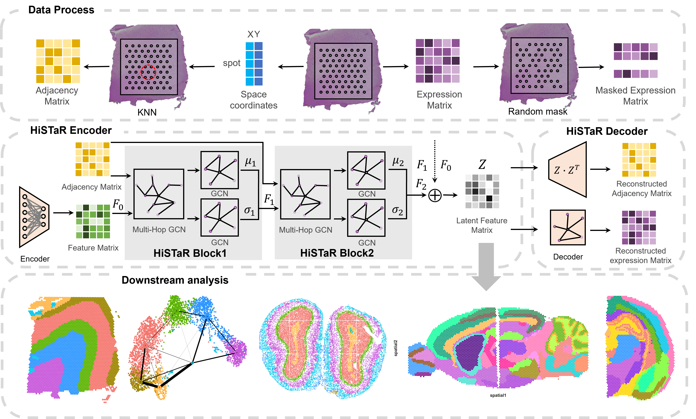

# HiSTaR : identifying spatial domains in spatial transcriptomics data with Hierarchical Decoupled Variational Autoencoder

## Overview of HiSTaR

we propose a Hierarchical ST variational autoencoder (HiSTaR) to extract multi-level latent features of spots. HiSTaR tends to perform well in identifying spatial domains across multiple datasets from diverse platforms, consistently showing superior results compared to existing methods.
## Starting
Please check the tutorial [Tutorials of HiSTaR](https://histar-tutorials.readthedocs.io/en/latest/index.html)

1.Python

    git clone https://github.com/Anglejuebi/HiSTaR
    cd HiSTaR
    python setup.py build
    python setup.py install

2.Anaconda (recommend)

    conda create -n HiSTaR python=3.11
    conda activate HiSTaR
    git clone https://github.com/Anglejuebi/HiSTaR
    cd HiSTaR
    python setup.py build
    python setup.py install

## DataSets
**The complete experimental dataset of HiSTaR is available [here](https://zenodo.org/records/15599070)**   
The raw Human DLPFC data can be downloaded [here](http://spatial.libd.org/spatialLIBD/) 
The raw breast cancer data can be downloaded [here](https://www.10xgenomics.com/datasets/human-breast-cancer-block-a-section-1-1-standard-1-1-0;) 
The raw Mouse Brain data can be downloaded [here](https://www.10xgenomics.com/datasets/mouse-kidney-section-coronal-1-standard-1-1-0)  
The raw Slide-SeqV2 mouse olfactory bulb data can be download [here](https://singlecell.broadinstitute.org/single_cell/study/SCP815/highly-sensitive-spatial-transcriptomics-at-near-cellular-resolution-with-slide-seqv2#study-summary) 
The raw STARmap mouse visual cortex data can be dowmload [here](https://www.dropbox.com/sh/f7ebheru1lbz91s/AADm6D54GSEFXB1feRy6OSASa/visual_1020/20180505_BY3_1kgenes?dl=0&subfolder_nav_tracking=1) 
The raw STARmap mouse visual cortex data can be dowmload [here](https://www.dropbox.com/sh/f7ebheru1lbz91s/AADm6D54GSEFXB1feRy6OSASa/visual_1020/20180505_BY3_1kgenes?dl=0&subfolder_nav_tracking=1) 
thanks for the data from [SEDR_analyses](https://github.com/JinmiaoChenLab/SEDR_analyses), [STAGATE](https://drive.google.com/drive/folders/10lhz5VY7YfvHrtV40MwaqLmWz56U9eBP?usp=sharing), and [STGMVA](https://zenodo.org/records/8141084). 

## Project structure
    HiSTaR/
    ├── data/
    │   ├── Adult_Mouse_Brain/
    │   ├── BRCA1/
    │   ├── DLPFC/
    │   │   ├── 151507/
    │   │   ├── .../
    │   │   ├── 151675/
    │   │   └── 151676/
    │   │       ├── spatial/
    │   │       ├── filtered_feature_bc_matrix.h5
    │   │       └── metadata.tsv
    │   ├── .../
    │   ├── mouse_brain_anterior_posterior_sections.h5ad
    │   ├── mouse_breast_cancer_sample1_section1&2.h5ad
    │   └── STARmap_20180505_BY3_1k.h5ad
    ├── HiSTaR/
    ├── Tutorials/
    ├── requirements.txt
    ├── README.md
    ├── LICENSE
    └── setup.py
**The complete experimental dataset of HiSTaR is available [here](https://zenodo.org/records/15599070)**   

## Compared tools
Tools that are compared include:
- [SEDR](https://github.com/JinmiaoChenLab/SEDR): Unsupervised Spatial Embedded Deep Representation of Spatial Transcriptomics
- [ST-SCSR](https://github.com/xkmaxidian/ST-SCSR): Identifying spatial domains in spatial transcriptomics data via structure correlation and self-representation
- [DeepST](https://github.com/JiangBioLab/DeepST): Identification of spatial domains in spatial transcriptomics by deep learning
- [STAGATE](https://github.com/QIFEIDKN/STAGATE): Deciphering spatial domains from spatially resolved transcriptomics with an adaptive graph attention auto-encoder
- [STMGraph](https://github.com/binbin-coder/STMGraph): spatial-context-aware of transcriptomes via a dual-remasked dynamic graph attention model

## Contact
If you encounter any problems, Please feel free contact me <a href="Angle_Yu@e.gzhu.edu.cn" title="Email">Angle_Yu@e.gzhu.edu.cn</a> 

